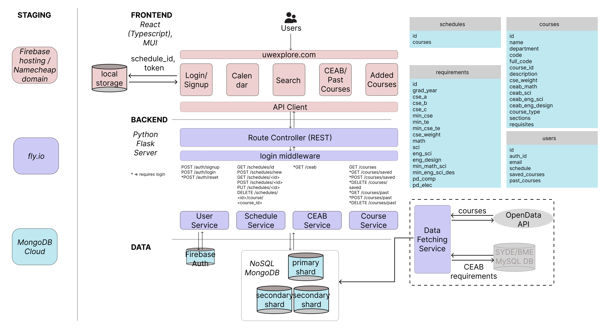

# uwexplore


**uw**explore is a web application that streamlines the course searching and planning process for University of Waterloo undergraduate students (with a special focus on Systems Design Engineering Students). The interactive planner allows students to view past information about courses, check that they satisfy their graduation requirements, and visualize their schedule for the upcoming term.

_Winner of the 2023 Ojala Best Overall Systems Design Engineering Capstone Project._

## Software

Built with Mongo + Flask + React



## Local Development Setup

1. Make a copy of `.env.example` and `frontend/.env.example`
2. Rename each copy to `.env`
3. Add the appropriate values to each `.env` file
4. Start all containers by running `docker-compose up` in the project root directory

## Lint

Upon making any backend changes, lint all the files before opening a pull request:

```
docker exec -it backend /bin/bash -c "black . && isort --profile black ."
```
